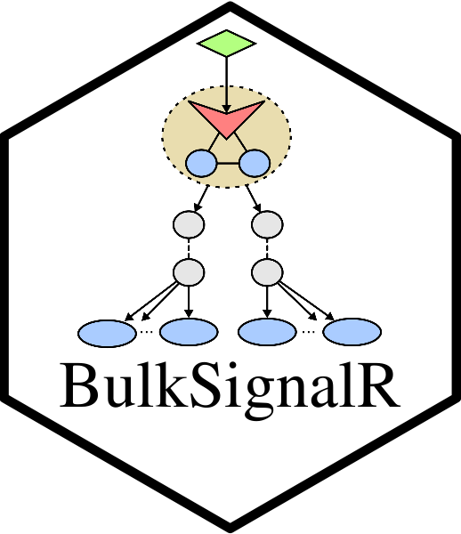

# BulkSignalR 

<!-- badges: start -->
[](https://github.com/ZheFrench/BulkSignalR/actions)
[](https://github.com/ZheFrench/BulkSignalR/actions)

[](https://cran.r-project.org/package=BulkSignalR)
[](https://cran.r-project.org/package=BulkSignalR)
<!-- badges: end -->

## Overview

Inference of ligand-receptor (LR) interactions from `bulk`
(transcriptomic or proteomic) data. **BulkSignalR** bases its inferences
on the LRdb database included in our other package, **SingleCellSignalR**
available from Bioconductor [here](https://www.bioconductor.org/packages/release/bioc/html/SingleCellSignalR.html). It relies on a statistical model that
is specific to bulk data sets. Different visualization and data
summary functions are proposed to help navigating prediction results.


## Installation

``` R

# The easiest way to get BulkSignalR is to install :
install.packages("BulkSignalR")

# Or the development version from GitHub:
# install.packages("devtools")
devtools::install_github("ZheFrench/BulkSignalR")
devtools::install_github("jcolinge/BulkSignalR")

```

## HowTo

The full description of the package can be access [Here](https://zhefrench.github.io/BulksignalR/).  
All instructions, documentation, and tutorials can be found on this website.

For a version history/changelog, please see the [NEWS file](https://github.com/zhefrench/BulksignalR/blob/master/NEWS.md).


**BulkSignalR** has been successfully installed on Mac OS X, Linux, and Windows using R 4.2 version, from your repository with GitHub Actions.

<!-- badges: start -->
[](https://svgshare.com/i/Zhy.svg)
[](https://svgshare.com/i/ZjP.svg)
[](https://svgshare.com/i/ZhY.svg)
<!-- badges: end -->


The code in this repository is published with the [CeCILL](https://github.com/zhefrench/BulksignalR/blob/master/LICENSE.md) License.


<!-- badges: start -->
[](https://shields.io/)
<!-- badges: end -->


