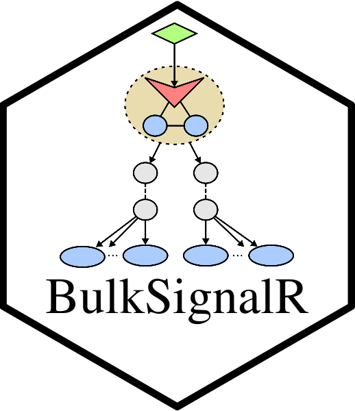
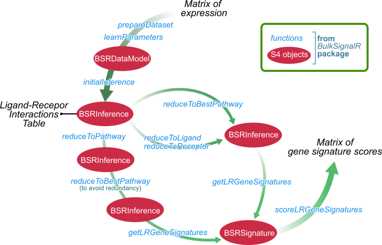

# BulkSignalR 
  

<!-- badges: start -->


<!-- badges: end -->


## Overview

**BulkSignalR** is used to infer ligand-receptor (L-R) interactions from bulk
expression (transcriptomics/proteomics) data, or medium resolution spatial
transcriptomics such as the 10x Genomics Visium platform. Particular types of
bulk data are also supported such as purified cell populations transcriptomics
and proteomics, or PDX mRNA-sequencing.

Known L-R interactions are taken from the
LR*db* database, which was previously included in our other package 
**SingleCellSignalR**, also available from Bioconductor 
[here](https://www.bioconductor.org/packages/release/bioc/html/SingleCellSignalR.html).
Now, LR*db* is distributed and updated separately. 

Inferences rely on a statistical model linking potential L-R interactions
with biological pathways downstream the receptor as defined in Reactome or
GO Biological Processes.

A number of visualization and data summary functions are proposed to
help navigating the predicted interactions.

Note that due to BulkSignalR introduction in Bioconductor, we modified certain
class definitions and functions to adhere to Bioconductor standards. An overview
of changes in BulkSignalR usage compared to early versions is provided in the
companion project: BulkSignalR_companion.



  

## Installation

``` R

# BulkSignalR directly from Bioconductor.
if (!require("BiocManager", quietly = TRUE))
    install.packages("BiocManager")
BiocManager::install("BulkSignalR")

# or Installation goes via GitHub:
# install.packages("devtools")
devtools::install_github("jcolinge/BulkSignalR",build_vignettes = TRUE)

# To read the vignette
# browseVignettes("BulkSignalR")

```

## Notes

For a version history/change logs, see the [NEWS file](https://github.com/jcolinge/BulksignalR/blob/master/NEWS).

**Previous versions of BulkSignalR** (before introduction in Bioconductor) are availabe in
the branch named before_BC at GitHub.com/jcolinge/BulkSignalR.

**BulkSignalR** has been successfully installed on Mac OS X, Linux, and Windows using R version 4.5.


The code in this repository is published with the [CeCILL](https://github.com/jcolinge/BulksignalR/blob/master/LICENSE.md) License.


<!-- badges: start -->
[](https://shields.io/)
<!-- badges: end -->


