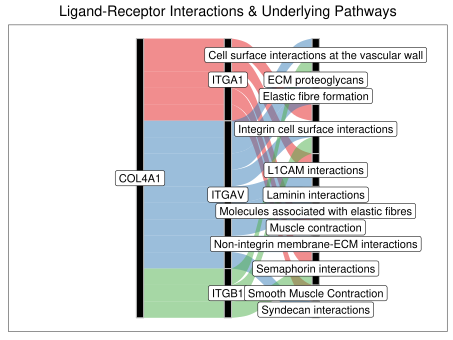
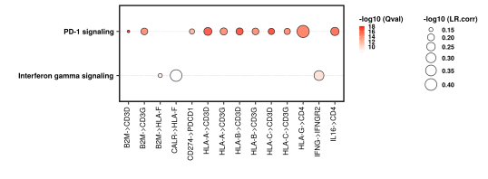
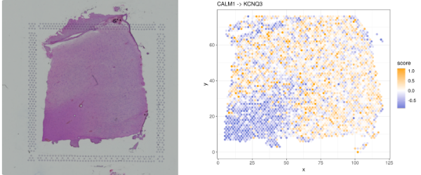

```{r, include = FALSE}
knitr::opts_chunk$set(
  collapse = FALSE, 
  comment = "##"
)
knitr::knit_hooks$set(optipng = knitr::hook_optipng)
```

# Load packages {.unnumbered}
```{r load-libs, message = FALSE,  warning = FALSE, results = FALSE}
library(BulkSignalR)
library(igraph)
library(dplyr)
library(kableExtra)
```

# Introduction

## What is it for ? 

`BulkSignalR` is  is a tool that enables the detection of Ligand-Receptor (LR)
interactions.

Originally developed for bulk RNA-SEQ, its application can be extended to
spatial transcriptomics as 10X’s Visium technology,

## Starting point 

There are a variety of steps upstream of `BulkSignalR` that result
in the generation of counts or normalized counts (RPKM, CPM, TPM...) 
for each sample, which can be seamlessly used  in our workflow.

The minimal unit of data required to run `BulksignalR` is : <br/>  
- A matrix with the expression where rows = genes
and columns = samples. The first column of the table must contain
gene names as HUGO symbols.

## How it works ? 

As described on figure below, a few steps are required in order to 
process a `BulkSignalR` analysis.

Three S4 objects will be sequentially constructed as follows :  
* **BSR-DataModel**, annotated as `bsrdm`  
* **BSR-Inference**, annotated as `bsrinf`  
* **BSR-Signature**, annotated as `bsrsig` 


**BSR-DataModel** will integrates the raw matrix and stores the 
learned parameters of the LR correlation distribution. 

**BSR-Inference** will provide the list of LR interactions annotated with their
potential underlying pathways. As a first result, you can easily export 
this table using `LRinter` function.  

**BSR-Signature** will compute gene signature scores for each samples, by focusing
either on LR interactions or on pathways. Finally, user can visualize these 
scoring via heatmaps to highlight some patterns in the data.  

Ligand-Receptor interaction might contain redundant information that can
be filtered out using several reduction strategies 
(`reduceToPathway`,`reduceToBestPathway`,...)  detailed in the following
sections.   

Furthermore, we provide several handy functions to explore the data 
via different plots (heatmap, alluvial plot, chordiagram or networks).

`BulkSignalR` package functions have many arguments parameters that can be 
changed by the user to fit its needs (see Reference Manual for more details). 

## Parallel mode settings

User can simply increases the speed of an analysis
by using several cores in parallel.
For this purpose, one can set the number of cores
he wants to use before starting `BulkSignalR`.

In parallel mode, an `iseed`  can be provided with `clusterSetRNGStream` in 
order to reproduce the exact same analysis due to sampling
In standard mode,  `set.seed()` is sufficient.

```{r parallel , message= FALSE, warnings=FALSE}
library(doParallel)
n.proc <- 2
cl     <- makeCluster(n.proc)
clusterSetRNGStream(cl, iseed = 1983)
registerDoParallel(cl)

# To add at the end of your script
# stopCluster(cl)
```

# First example  

## Loading the data

Here, we load salivary duct carcinoma transcriptomes integrated as 
`sdc` in `BulkSignalR`.

```{r loading}
data(sdc)
head(sdc)
```  
  
## Building a BSR-DataModel  

`prepareDataset` will create the first object with information
relative to your experiment.

```{r prepareDataset , cache=TRUE}
bsrdm <- prepareDataset(counts = sdc)
# print object
str(bsrdm)
```
  
`learnParameters` will be updated with parameters
of LR correlation distribution. You can specify the directory and
the file name  where you want to plot this distribution.

`null.model` is set automatically according to the shape 
of this distribution. 

However `BulkSignalR` authorize several modes for this parameter. 
(Please check Reference Manual for more details)

```{r learnParameters , cache=TRUE,results=FALSE}
bsrdm <- learnParameters(bsrdm,  quick = FALSE, 
         plot.folder = "../man/figures/", filename = "sdc")
```

```{r printBsrdm , cache=TRUE}
# print object updated 
str(bsrdm)
```
The plot with distribution of LR correlation in `sdc` is displayed below. 


## Building a BSR-Inference

From the previous object `bsrdm` , you will create `bsrinf`  by calling 
`initialInference` . `bsrinf` contains the inferred LR interactions 
with their associated pathways and corrected p-values.  

From here, you can already access LR interactions using : `LRinter(bsrinf)`.

```{r BSRInference , cache=TRUE}
bsrinf <- initialInference(bsrdm)

LRinter.dataframe <- as.data.frame(LRinter(bsrinf))

knitr::kable(head(LRinter.dataframe[order(LRinter.dataframe$qval <= 0.001),
  c("L",	"R"	,"LR.corr",	"pw.id",	"pw.name",	"pval"	,	"qval")]),row.names = FALSE) %>%
  kable_material(c("striped", "hover"))
```
<br/>
You can finally filter out the less significant LR interactions and order them 
by best q-value before saving them to a file.

```{r BSRInferenceTfile, eval=FALSE}
write.table(LRinter.dataframe[order(LRinter.dataframe$qval <= 0.001),],
            "../man/figures/sdc_LR.tsv",
            row.names = FALSE,
            sep = "\t",
            quote = FALSE)
```

## Reduction strategies

Raw results from `LRinter(bsrinf)` can suffer from redundancy.
LR interactions can appear several times 
in several pathways.  

To resolve this pitfall, we propose several ways to
reduce information in order to increase
readability of the results.

User can simplify a `bsrinf` object on demand, to focus etheir on
the pathways or on LR interactions.

### Reducing a BSRInference to pathway

With `reduceToPathway` ,all the ligands and receptors forming pairs related
to a certain pathway, are pulled together to only report one one row per pathway.
For a given pathway, the reported P-values and target genes are those 
of the best LR pair that appeared in this pathway.

```{r ReduceToPathway, cache=TRUE}
     bsrinf.redP <- reduceToPathway(bsrinf)  
     # write.table(as.data.frame(LRinter(bsrinf.redP)), 
     # "../man/figures/sdc_LR.reduceToPathway.tsv", 
     # row.names = FALSE, sep="\t", quote=FALSE)
```

### Reducing a BSRInference to best pathway

With `ReduceToBestPathway`, a BSR-Inference object is reduced to only report
one pathway per LR pair. The pathway with the smallest P-value 
is selected for the pair.
Pathways can be on several rows associated with different LR interactions.

```{r ReduceToBestPathway, cache=TRUE}
     bsrinf.redBP    <- reduceToBestPathway(bsrinf)
     
     # write.table(as.data.frame(LRinter(bsrinf.red)),
     # "../man/figures/sdc_LR.reduceToBestPathway.tsv", 
     # row.names = FALSE, sep="\t", quote=FALSE)
```
### Double Reduction

User can apply `reduceToPathway(bsrinf)` and `reduceToBestPathway(bsrinf)` 
reductions sequentially to maximize reduction effect.

If the exact same pool of LR given by `reduceToPathway(bsrinf)`  is associated 
with several pathways, the pathway with the best p-value for this pool will be 
kept by `reduceToBestPathway(bsrinf)`.

```{r doubleReduction, cache=TRUE}
     bsrinf.redP  <- reduceToPathway(bsrinf)  
     bsrinf.redPBP <- reduceToBestPathway(bsrinf.redP) 
     
     # write.table(as.data.frame(LRinter(bsrinf.redPBP)),
     # "../man/figures/sdc_LR.double.reduction.tsv", 
     # row.names = FALSE, sep="\t", quote=FALSE)
```

These reductions will be useful in order to compute gene signature and
visualize our data. This will be explained below.

## Building a BSR-Signature 

Finally we applied `getLRGeneSignatures` with the different 
BSR-Inference object previously reduced.
Thus, we will create several `BSR-Signature object` `bsrsig.redPP`.

`scoreLRGeneSignatures` is applied conjointly on BSR-Inference & BSR-Signature
objects to score signatures at the pathway or LR interaction levels.  

Then, we provide a `simpleHeatmap` function to visualize gene score signatures 
inside a heatmap as shown below.

###  Scoring by ligand-receptor

```{r scoringLR  ,cache=TRUE,results=FALSE,eval=FALSE}

     bsrsig.redBP <- getLRGeneSignatures(bsrinf.redBP, qval.thres=0.001)

     scoresLR <- scoreLRGeneSignatures(bsrdm,bsrsig.redBP,name.by.pathway=FALSE)
     
     simpleHeatmap(scoresLR[1:20,], 
                   path = "../man/figures/",
                   filename = "sdc_scoresLR",
                   column.names = TRUE, 
                   height = 5, width = 9,
                   pointsize = 10,
                   hcl_palette = "Cividis"                   
                   )
     
   

    # You can easily export the scoring matrix for LR as follows
    # write.table(scoresLR, 
    # "../man/figures/sdc_scoreLR.tsv",
    # col.names = NA,sep = "\t",
    # quote = FALSE)
```


###  Scoring by pathway

```{r scoringPathway, cache=TRUE,results=FALSE,eval=FALSE}    
     bsrsig.redPBP <- getLRGeneSignatures(bsrinf.redPBP,qval.thres=0.001)
     
     scoresPathway <- scoreLRGeneSignatures(bsrdm,bsrsig.redPBP,name.by.pathway=TRUE)
     
     simpleHeatmap(scoresPathway[1:10,], 
                   path = "../man/figures/",
                   filename = "sdc_scoresPathway",
                   column.names = TRUE, 
                   width = 9, 
                   height = 5, 
                   pointsize = 12,
                   hcl_palette = "Blue-Red 2"
                   )

     # Dual Heatmap for comparing pre-existing signature
     # data(immune.signatures, package="BulkSignalR")
     # imm.scores <- scoreSignatures(bsrdm, immune.signatures)
     # dualHeatmap(scoresPathway, imm.scores, width=6, height=9,
     # file="SDC-LR-dualheatmap.pdf",
     # pointsize=4, vert.p=0.85)
     
     # You can easily export the scoring matrix for pathways as follows
     # write.table(scoresPathway,
     # "../man/figures/sdc_scorepathways.tsv",
     # col.names = NA,sep = "\t",
     # quote = FALSE)
```


## Other Visualisation utilities

In the next section, we show how to visualize the data in different ways.

### Heatmap Expression Ligand-Receptor-Target

Once you have compute gene signatures score. One may wish to look at the
expression of the genes  involved in that signature.

For instance, here we display three heatmaps corresponding to the z-scored
expression of Ligands (Pink), Receptors (Green) and Targets (Blue).  
On top, user can see the original scoring computed before 
by `scoreLRGeneSignatures` for the given pathway.

```{r HeatmapRTL ,results=FALSE,,eval=FALSE}   
pathway1 <- "Elastic fibre formation"
signatureHeatmaps(
        pathway = pathway1,
        bsrdm = bsrdm,
        bsrsig = bsrsig.redPBP,
        path = "../man/figures/",
        filename = "sdc_signatureheatmap",
        width  = 15,
        height = 10 ,
        show_column_names = TRUE)
```        


### AlluvialPlot

`alluvial.plot` is a function that let the user observed the different links
between ligands, receptors and pathways stored inside `bsrinf` object.

First you need to specify if you want to filter by Ligand, Receptor or Pathway.
Then, you have to pass a keyword (gene name or pathway) to keep only the links
related to your choice.  

You also can apply a filter on Q-value to limit the number of links and improve 
rendering.

```{r AlluvialPlot,results=FALSE}   

alluvialPlot(bsrinf,
              keywords = c("COL4A1"),
              type = "L",
              qval = 0.001,
              path = "../man/figures/",
              filename = "sdc_alluvial", 
              width  = 16, 
              height = 12
              )

```



### BubblePlot

`bubblePlot.pathways.LR` is a handy way to visualize strength of several LR
interactions in  relation with their associated pathways.

You have to give a vector of pathways.  

Do not add too many pathways. otherwise the graph will be unreadable.  

```{r BubblePlot,results=FALSE} 
pathway1 <- "PD-1 signaling"
pathway2 <- "Interferon gamma signaling"
pathways <- c(pathway1,pathway2)

bubblePlotPathwaysLR(bsrinf,
    pathways = pathways, 
    threshold = 1,
    path = "../man/figures/",
    color = "red",
    filename  = "sdc_bubble", 
    width  = 16, 
    height = 7,
    pointsize = 8
    #filter.L = c("ADAM12")
    #filter.R = c("ITGA3")
    ) 
```
 


### Chordiagram

`chord.diagram.LR` is a function that let the user observe the different
LR interactions for one specific pathway.

LR correlations strength are drawn in yellow.  
Ligand are in grey, whereas Receptors are in green.  
You can highlight in red one specific interaction by passing values 
of a LR pair as follows  `ligand="COL18A1", receptor="ITGA3"`.  

```{r Chordiagram,results=FALSE,eval=FALSE} 
chordDiagramLR (bsrinf,
                  path = "../man/figures/",
                  filename = "sdc_chord",
                  pw.id.filter = "R-HSA-202733",
                  ligand = "COL18A1",
                  receptor = "ITGA3",
                  limit = 20,
                  width = 5, 
                  height = 4.5
    )
```


# Network analysis

`BulkSignalR`  can also map internal network linked to genes of interest through
the integration of regulated KEGG and Reactome pathways together with ligands
and receptors involved in inferred interactions.

The networks can be exported in text files and graphML objects 
to be further explored with Cytoscape (www.cytoscape.org), 
yEd (www.yworks.com), or similar software tools.

```{r network, cache=TRUE, results=FALSE} 
# Generate a ligand-receptor network and export it in .graphML
# for Cytoscape or similar tools
gLR <- getLRNetwork(bsrinf.redBP, qval.thres=1e-8)

# save to file
# write.graph(gLR,file="SDC-LR-network.graphml",format="graphml")

# As an alternative to Cytoscape, you can play with igraph package functions.
plot(gLR,
     edge.arrow.size=0.1,
     vertex.label.color="black",
     vertex.label.family="Helvetica",
     vertex.label.cex=0.1)

# You can apply other functions.
# For the next steps, we just share the code below but graph generation function
# are commented to lighten the vignette.

# Community detection
u.gLR <- as.undirected(gLR) # most algorithms work for undirected graphs only
comm <- cluster_edge_betweenness(u.gLR)
# plot(comm,u.gLR,
#     vertex.label.color="black",
#     vertex.label.family="Helvetica",
#     vertex.label.cex=0.1)

# Cohesive blocks
cb <- cohesive_blocks(u.gLR)
plot(cb,u.gLR,
     vertex.label.color="black",
     vertex.label.family="Helvetica",
     vertex.label.cex=0.1,
     edge.color="black")

# Generate a ligand-receptor network complemented with intra-cellular,
# receptor downstream pathways [computations are a bit longer here]
#
# You can save to a file for cystoscape or plot with igraph.

 gLRintra <- getLRIntracellNetwork(bsrinf.redBP, qval.thres=1e-8)

lay <- layout_with_kk(gLRintra)
# plot(gLRintra,
#     layout=lay,
#     edge.arrow.size=0.1,
#     vertex.label.color="black",
#     vertex.label.family="Helvetica",
#     vertex.label.cex=0.1)

# Reduce complexity by focusing on strongly targeted pathways
pairs <- LRinter(bsrinf.redBP)
top <- unique(pairs[pairs$pval<1e-20,c("pw.id","pw.name")])
top
gLRintra.res <- getLRIntracellNetwork(bsrinf.redBP, qval.thres=0.01,
                                      restrict.pw=top$pw.id)
lay <- layout_with_fr(gLRintra.res)

# plot(gLRintra.res,
#     layout=lay,
#     edge.arrow.size=0.1,
#     vertex.label.color="black",
#     vertex.label.family="Helvetica",
#     vertex.label.cex=0.4)
    
```

# Alternative workflow for non human species

<br/>

In order to process a non human organism,
user can call a few set of supplementary functions 
By default, `BulksignalR` works with Homo Sapiens.
We developp a stragtegy using orthologous genes from the 
orthogene package directly integrated in BulkSignalR.

`findOrthoGenes` create a correspondence table between
human and another organism.

`convertToHuman`  will convert initial matrix to hsapiens genes nomenclature.

When you call `prepareDataset` , you need to pass this transformed matrix,
the initial organism and the correspondence table.

Inference calling is done as for a normal workflow.

Finally, you switch back to gene names relative to the initial organism
for which experiment was done via `resetToInitialOrganism` 
The rest of the workflow is done as usual for
computing signature and visualization.

<br/>

```{r mouse , cache=TRUE,results=FALSE,eval=FALSE}
data(bodyMap.mouse)

ortholog.dict    <- findOrthoGenes (from_organism = "mmusculus", 
                                     from_values = rownames(bodyMap.mouse))
 
matrix.expression.human <- convertToHuman(counts = bodyMap.mouse, 
                                           dictionary = ortholog.dict)

bsrdm  <- prepareDataset(counts = matrix.expression.human,
           species = "mmusculus",
           conversion.dict = ortholog.dict)

bsrdm <- learnParameters(bsrdm,  quick = FALSE, 
           plot.folder="../man/figures/",filename = "bodyMap.mouse")
 
bsrinf  <- initialInference(bsrdm)

bsrinf  <- resetToInitialOrganism(bsrinf, conversion.dict=ortholog.dict)

# For example, if you want to explore LR interactions
# you can proceed as showed before for a human dataset.

# bsrinf.redBP <- reduceToBestPathway(bsrinf)  
# bsrsig.redBP <- getLRGeneSignatures(bsrinf.redBP, qval.thres=0.001)
# scoresLR <- scoreLRGeneSignatures(bsrdm,bsrsig.redBP,name.by.pathway=FALSE)
# simpleHeatmap(scoresLR[1:20,], file="sdc_scoreLR.pdf", column.names=TRUE,
# width=9, height=5, pointsize=8)

```

# Spatial Transcriptomics

You can reproduce the exact same workflow for Spatial Transcriptomics.  
Here, we consider a spot as a sample. So you will start with a matrix, generaly
exported from Seurat or SpatialExperiment, where column names are spot ids.  

We implemented a convenient function `spatialPlot` to visualize scoring 
on 2D space with a reference plot (raw image or areas) side-by-side.  

You need to pass :  
* A named vector with spatial ids and numeric values  
* A dataframe with spatial ids, x/y coords, and numeric values for LRscore.  

You can integrate the raw image from filepath using `rasterizeFromFile`.
Of note the raster image, can also be extracted from Seurat 
or SpatialExperiment objects.

We also provide functions to manipulate the raw image via raster object using
`coordsFlip` and `scalesReverse` .

`BulkSignalR` package functions have many arguments that can be
customized by the user (we highly recommend to browsing the
Reference Manual for more details).  

```{r spatial , eval=FALSE}
     # Extract matrix of counts
     #
     # From Seurat
     # matrix.count <-   as.data.frame(
     #            as.matrix(seurat.object@assays$Spatial@counts))
     # From SpatialExperiment
     # matrix.count <- as.data.frame(
     #       SummarizedExperiment::assays(spe.object)[[1]])

     # Classical BulksignalR workflow
     # ...
     # ...
     # you apply the workflow as described before until you get the scores
     scoresLR <- scoreLRGeneSignatures(bsrdm,bsrsig.redBP,name.by.pathway=FALSE)
     #
     # you retrieve score from one specific interaction 
     # (using rownames from scoresLR)
     LR <- "CALM1 -> KCNQ3"
     score <- setNames(as.vector(scoresLR[LR,]),
                       as.character(colnames(scoresLR)))
     #
     # You need to load another dataframe (here called spot)
     # with id, coordinates and labels, as described below.
     #
     # idSpatial array_col array_row ground_truth
     # 50x102       102        50      Label3
     #   3x43        43         3      Label1
     #  59x19        19        59      Label2
     #  14x94        94        14      Label3
     #   43x9         9        43      Label5
     #  47x13        13        47      Label6

     # Retrieve raw image
     #
     # From disk
     # image.raster <- rasterizeFromFile(filePath)
     # From Seurat
     # image.raster <- GetImage(seurat.object, mode = c("raster")) 
     # From SpatialExperiment
     # img <- imgRaster(spatialExperiment, 
     #      sample_id = "sample_151673", image_id = "lowres")

    spatialPlot(
	  score,
	  spot[spot$in_tissue==1,], 
	  inter.name = LR, 
      rev.y=FALSE, 
      rev.x=FALSE, 
      ref.plot=TRUE,
      image.raster=NULL,
      x.col="array_col", 
      y.col="array_row",
      label.col="ground_truth", 
      idSpatial.col="idSpatial",
      cut.p=0.01, 
      low.color="royalblue3",
      mid.color="white", 
      hi.color="orange",
      title.fs=12, 
      legend.fs=10, 
      axis.fs=10,
      label.fs=12
	) 
```



<br/>

# Acknowledgements

We would like to thank a few people who contributed to this work :  
- Laia Bassaganyas for insightful comments on the manuscript.  
- Guillaume Tosato for his help with the figures.  
- Gauthier Gadouas for testing the software on different platforms.

<br/>

Thank you for reading this guide and for using `BulkSignalR`.

# Session information

```{r session-info}
sessionInfo()
```


