```{r, include = FALSE}
knitr::opts_chunk$set(
  collapse = FALSE, 
  comment = "##"
)
knitr::knit_hooks$set(optipng = knitr::hook_optipng)
```

# Load packages {.unnumbered}
```{r load-libs, message = FALSE,  warning = FALSE, results = FALSE}
library(BulkSignalR)
library(igraph)
library(dplyr)
library(kableExtra)
```
\

# Introduction

\

## What is it for? 

`BulkSignalR` is a tool that enables the inference of L-R
interactions from bulk expression data, *i.e.*, from transcriptomics
(RNA-seq or microarrays) or expression proteomics.

`BulkSignalR` also applies to spatial transcriptomics such as
10x Genomics VISIUM (TM), and a set of
functions dedicated to spatial data have been added to better support
this particular use of the package.

## Starting point 

There are a variety of potential data sources prior to using `BulkSignalR`
(proteomics, sequencing, etc.) that result
in the generation of a matrix of numbers representing the expression
levels of genes or proteins. This matrix may be normalized already or not.
In every case, the latter matrix is the starting point of using
`BulkSignalR`.

It is mandatory that genes/proteins are represented as rows of the
expression matrix and the samples as columns. HUGO gene symbols
(even for proteins) must be used to ensure matching LR*db*,
Reactome, and GOBP contents.

## How does it work? 

As represented in the figure below, only a few steps are required in order to 
perform a `BulkSignalR` analysis.

Three S4 objects will be sequentially constructed:  
* **BSR-DataModel**, denoted `bsrdm`  
* **BSR-Inference**, denoted `bsrinf`  
* **BSR-Signature**, denoted `bsrsig`

\

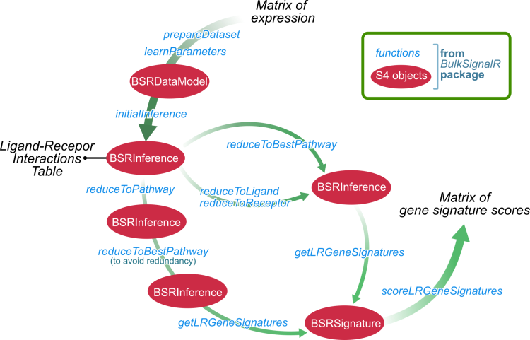
\

**BSRDataModel** integrates the expression data matrix and the 
parameters of the statistical model learned on this matrix.

**BSRInference** provides a list triples (ligand, receptor, pathway downstream
the receptor) with their statistical significance. If a receptor occurs
in multiple pathways, the corresponding number of triples will be described
in the BSR-Inference object. Genes (or proteins) targeted by the pathway
are also described in this object.

**BSRSignature** contains gene signatures associated with the triples
(ligand, receptor, downstream pathway)
stored in a `BSRInference` object. Those signatures are comprised
of the ligand and the receptor obviously, but also all the pathway
target genes that were used by the statistical model. Gene signatures
are meant to report the L-R interaction as a global phenomenon integrating
its downstream effect. Indeed, signatures can be scored with a dedicated
function allowing the user to set an arbitrary weight on the downtream
component. Those scores represent the activity of the L-R interactions
across the samples, they are returned as a matrix.

Because of the occurrence of certain receptors in multiple pathways,
but also because some ligands may bind several receptors, or *vice versa*,
BSR-Inference objects may contain redundant data depending on how
the user want to look at them. We therefore provide a range of
reduction operators meant to obtain reduced BSR-Inference objects
(see below).  

\

Furthermore, we provide several handy functions to explore the data 
through different plots (heatmaps, alluvial plots, chord diagrams or networks).

`BulkSignalR` package functions have many parameters that can be 
changed by the user to fit specific needs (see Reference Manual for details). 

\

## Parallel mode settings

Users can reduce compute time
by using several processors in parallel.

```{r parallel , message= FALSE, warnings=FALSE}
library(doParallel)
n.proc <- 2
cl <- makeCluster(n.proc)
registerDoParallel(cl)

# To add at the end of your script
# stopCluster(cl)
```

### Notes:
For operating systems that can fork such as all the UNIX-like systems,
it might be preferable to use the library `doMC` that is faster (less
overhead). This is transparent to `BulkSignalR`.

In case you need to reproduce results exactly and since statistical
model parameter learning involves the generation of randomized expression
matrices, you might want to use `set.seed()`. In a parallel mode,
`iseed` that is a parameter of `clusterSetRNGStream` must be used.

\
\

# First Example  

\

## Loading the data

Here, we load salivary duct carcinoma transcriptomes integrated as 
`sdc` in `BulkSignalR`.

```{r loading,eval=FALSE}
data(sdc)
head(sdc)
```  
```{r displayLoading,eval=FALSE}
##          SDC16 SDC15 SDC14 SDC13 SDC12 SDC11 SDC10 SDC9 SDC8 SDC7 SDC6 SDC5
## TSPAN6    1141  2491  1649  3963  2697  3848  3115  495 1777 1997 1682 1380
## TNMD         3     0     2    48     0     0    10    0  195    0    4    0
## DPM1      1149  2105  1579  2597  2569  2562  1690  964  980 3323 3409  743
## SCYL3     1814   768  3513  1402  1007  1243  2501 3080  939 1190 1489 1097
## C1orf112   438  1016   507  1149   598  1017   464  531  388 1088 1719  625
## FGR        381   922   307   256   249   902   304  355  410 1054  265  121
##          SDC4 SDC3 SDC2 SDC1 SDC17 SDC19 SDC20  N20 SDC21 SDC22  N22 SDC23
## TSPAN6   1392 2490 1841 1883  1915  4093  3127 8035  4738  2994 9782  3866
## TNMD        0    0    0    1     5     0    18   21     6     2   27     0
## DPM1     1147 1705 1972 3048  2405  2943  2710 1688  2654  2772 2018  1610
## SCYL3     507 1545 2450 2006   910  1842  2947 1058  2636  4199 1173  2980
## C1orf112  318 1338 3065  723   509  1320   767  179   718  1498  147   629
## FGR       408  813  787 1152  1049  4205   722  149   584   701  164   842
##          SDC24 SDC25
## TSPAN6    3014  1765
## TNMD        14     3
## DPM1      2875  2357
## SCYL3     2079   903
## C1orf112  1008   521
## FGR        676   654
```  
\

## Building a BSRDataModel object  

`prepareDataset` creates the first object with information
relative to your bulk expression data.

```{r prepareDataset , eval=FALSE,cache=TRUE}
bsrdm <- prepareDataset(counts = sdc)
# print object
str(bsrdm)
```  
```{r output1 , eval=FALSE}
## Formal class 'BSRDataModel' [package "BulkSignalR"] with 6 slots
##   ..@ initial.organism : chr "hsapiens"
##   ..@ initial.orthologs: list()
##   ..@ ncounts          : num [1:16822, 1:26] 1286 3.38 1295.01 2044.52 493.66 ...
##   .. ..- attr(*, "dimnames")=List of 2
##   .. .. ..$ : chr [1:16822] "TSPAN6" "TNMD" "DPM1" "SCYL3" ...
##   .. .. ..$ : chr [1:26] "SDC16" "SDC15" "SDC14" "SDC13" ...
##   ..@ log.transformed  : logi FALSE
##   ..@ normalization    : chr "UQ"
##   ..@ param            : list()
``` 

`learnParameters` updates a BSR-DataModel object with the parameters
necessary for `BulkSignalR` statistical model. As it entails generating
Spearman correlation null distributions, you can provide a directory and
a base file name to plot this distribution along with the fitted
model for visual inspection.

```{r learnParameters , eval=FALSE,cache=TRUE,results=FALSE}
bsrdm <- learnParameters(bsrdm, 
         plot.folder = "../man/figures/", filename = "sdc")
```

```{r printBsrdm , eval=FALSE,cache=TRUE}
# print object updated 
str(bsrdm)
```
```{r output2, eval=FALSE}
## Formal class 'BSRDataModel' [package "BulkSignalR"] with 6 slots
##   ..@ initial.organism : chr "hsapiens"
##   ..@ initial.orthologs: list()
##   ..@ ncounts          : num [1:16822, 1:26] 1286 3.38 1295.01 2044.52 493.66 ...
##   .. ..- attr(*, "dimnames")=List of 2
##   .. .. ..$ : chr [1:16822] "TSPAN6" "TNMD" "DPM1" "SCYL3" ...
##   .. .. ..$ : chr [1:26] "SDC16" "SDC15" "SDC14" "SDC13" ...
##   ..@ log.transformed  : logi FALSE
##   ..@ normalization    : chr "UQ"
##   ..@ param            :List of 13
##   .. ..$ n.rand.LR   : int 5
##   .. ..$ n.rand.RT   : int 2
##   .. ..$ plot.folder : chr "../man/figures/"
##   .. ..$ file.name   : chr "sdc"
##   .. ..$ with.complex: logi TRUE
##   .. ..$ max.pw.size : num 200
##   .. ..$ min.pw.size : num 5
##   .. ..$ min.positive: num 4
##   .. ..$ quick       : logi FALSE
##   .. ..$ seed        : num 123
##   .. ..$ min.corr.LR : num -1
##   .. ..$ LR.0        :List of 2
##   .. .. ..$ n    : int 12915
##   .. .. ..$ model:List of 7
##   .. .. .. ..$ mu     : num 0.0172
##   .. .. .. ..$ sigma  : num 0.254
##   .. .. .. ..$ factor : num 1
##   .. .. .. ..$ start  : num 3.2e-05
##   .. .. .. ..$ distrib: chr "censored_normal"
##   .. .. .. ..$ D      : num 0.465
##   .. .. .. ..$ Chi2   : num 0.000521
##   .. ..$ RT.0        :List of 2
##   .. .. ..$ n    : int 954132
##   .. .. ..$ model:List of 7
##   .. .. .. ..$ mu     : num 0.015
##   .. .. .. ..$ sigma  : num 0.274
##   .. .. .. ..$ factor : num 1
##   .. .. .. ..$ start  : num 0.000107
##   .. .. .. ..$ distrib: chr "censored_normal"
##   .. .. .. ..$ D      : num 0.483
##   .. .. .. ..$ Chi2   : num 0.000226
```

The plot with distribution of L-R correlation in `sdc` is displayed below. 

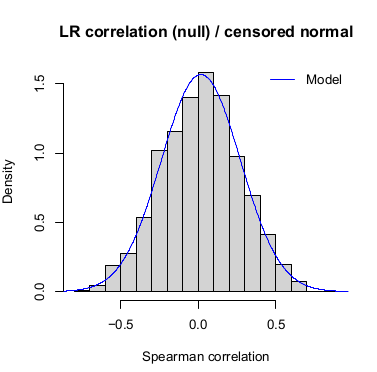

\

## Building a BSRInference object

From the previous object `bsrdm`, you can generate inferences by calling its
method
`initialInference`. The resulting BSR-Inference object, `bsrinf`,
contains all the inferred L-R interactions 
with their associated pathways and corrected p-values.  

From here, you can already access LR interactions using: `LRinter(bsrinf)`.

```{r BSRInference , eval=FALSE,cache=TRUE}
bsrinf <- initialInference(bsrdm)

LRinter.dataframe <- LRinter(bsrinf)

knitr::kable(head(LRinter.dataframe[order(LRinter.dataframe$qval <= 0.001),
  c("L",	"R"	,"LR.corr",	"pw.id",	"pw.name",	"pval"	,	"qval")]),row.names = FALSE) %>%
  kable_material(c("striped", "hover"))
```

| **L**  | **R** | **LR.corr** | **pw.id**     | **pw.name**                                          |  **pval** |  **qval** |
|--------|-------|------------:|---------------|------------------------------------------------------|----------:|----------:|
| A2M    | LRP1  |   0.5391453 | R-HSA-196854  | Metabolism of vitamins and cofactors                 | 0.0200711 | 0.0260773 |
| A2M    | LRP1  |   0.5391453 | R-HSA-2173782 | Binding and Uptake of Ligands by Scavenger Receptors | 0.0181048 | 0.0239389 |
| A2M    | LRP1  |   0.5391453 | R-HSA-2187338 | Visual phototransduction                             | 0.0174728 | 0.0232013 |
| A2M    | LRP1  |   0.5391453 | R-HSA-6806667 | Metabolism of fat-soluble vitamins                   | 0.0112186 | 0.0161057 |
| A2M    | LRP1  |   0.5391453 | R-HSA-975634  | Retinoid metabolism and transport                    | 0.0112186 | 0.0161057 |
| ADAM10 | AXL   |   0.4441026 | R-HSA-194138  | Signaling by VEGF                                    | 0.0029121 | 0.0056264 |

\

You can finally filter out non-significant L-R interactions and order them 
by best Q-value before saving them to a file for instance.

```{r BSRInferenceTfile, eval=FALSE}
write.table(LRinter.dataframe[order(LRinter.dataframe$qval <= 0.001),],
            "../man/figures/sdc_LR.tsv",
            row.names = FALSE,
            sep = "\t",
            quote = FALSE)
```

\

## Reduction strategies

The output of `initialInference` is exhaustive and can thus contain
redundancy due to intrinsic redundancy in the reference databases (Reactome,
KEGG, GOBP) and multilateral interactions in LR*db*.
To address this phenomenon, we propose several strategies.

### Reducing a BSRInference object to pathway

With `reduceToPathway`, all the L-R interactions with the receptor included
in a certain pathway are aggregated to only report each downstream pathway
once. For a given pathway, the reported P-values and target genes are those 
of best (minimum P-value) L-R interaction that was part of the aggregation.
Nothing is recomputed, we simply merge.

```{r ReduceToPathway, eval=FALSE,cache=TRUE}
     bsrinf.redP <- reduceToPathway(bsrinf)
```

### Reducing a BSRInference object to best pathway

With ` reduceToBestPathway`, a BSR-Inference object is reduced to only report
one pathway per L-R interaction. The pathway with the smallest P-value 
is selected.
A same pathways might occur multiple times with with different L-R interactions.

```{r ReduceToBestPathway, eval=FALSE,cache=TRUE}
     bsrinf.redBP    <- reduceToBestPathway(bsrinf)
```

### Reducing to ligands or receptors

As already mentioned, several ligands might bind a single receptor (or
several shared receptors) and the converse is true as well. Two
reduction operators enable users to either aggregate all the ligands
of a same receptor or all the receptors bound by a same ligand:

```{r ReduceToLigand, eval=FALSE,cache=TRUE}
     bsrinf.L    <- reduceToLigand(bsrinf)
     bsrinf.R    <- reduceToReceptor(bsrinf)
```

### Combined reductions

Combinations are possible.

For instance, users can apply `reduceToPathway` and `reduceToBestPathway` 
reductions sequentially to maximize the reduction effect. In case the exact
same sets of aggregated ligands and receptors obtained with `reduceToPathway`
was associated with several pathways, the pathway with the best P-value
would be kept by `reduceToBestPathway`.

```{r doubleReduction, eval=FALSE,cache=TRUE}
     bsrinf.redP  <- reduceToPathway(bsrinf)  
     bsrinf.redPBP <- reduceToBestPathway(bsrinf.redP) 
```

\

## Building a BSRSignature object

Gene signatures for a given, potentially reduced BSR-Inference object
are generated by `getLRGeneSignatures`, which returns a BSRSignature
object.

To follow the activity of L-R interactions across the samples of
the dataset, `scoreLRGeneSignatures` computes a score for each gene signature.
Then, heatmaps can be generated to represent differences, *e.g.*, using
the utility function a `simpleHeatmap`.

Hereafter, we show different workflows of reductions combined with gene
signature scoring and display.


###  Scoring by ligand-receptor

```{r scoringLR  ,cache=TRUE,results=FALSE,eval=FALSE}

     bsrsig.redBP <- getLRGeneSignatures(bsrinf.redBP, qval.thres=0.001)

     scoresLR <- scoreLRGeneSignatures(bsrdm, bsrsig.redBP,
                                       name.by.pathway=FALSE)
     
     simpleHeatmap(scoresLR[1:20,], 
                   path = "../man/figures/",
                   filename = "sdc_scoresLR",
                   column.names = TRUE, 
                   height = 5, width = 9,
                   pointsize = 10,
                   hcl_palette = "Cividis"                   
                   )
```

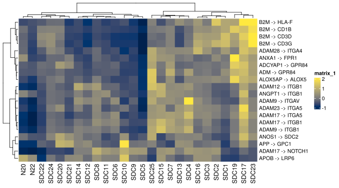

###  Scoring by pathway

```{r scoringPathway, cache=TRUE,results=FALSE,eval=FALSE}    
     bsrsig.redPBP <- getLRGeneSignatures(bsrinf.redPBP, qval.thres=0.001)
     
     scoresPathway <- scoreLRGeneSignatures(bsrdm, bsrsig.redPBP,
                                            name.by.pathway=TRUE)
     
     simpleHeatmap(scoresPathway[1:10,], 
                   path = "../man/figures/",
                   filename = "sdc_scoresPathway",
                   column.names = TRUE, 
                   width = 9, 
                   height = 5, 
                   pointsize = 12,
                   hcl_palette = "Blue-Red 2"
                   )

```

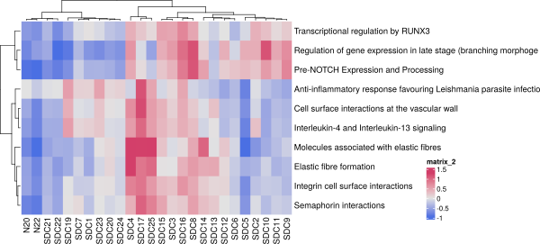

\

## Other visualization utilities


### Heatmap of ligand-receptor-target genes expression

After computing gene signatures score, one may wish to look at the
expression of the genes involved in that signature. For instance,
we can display three heatmaps corresponding to the scaled (z-scores)
expression of ligands (pink), receptors (green), and target genes (blue).

On the top of each heatmap, the whole signature score from
`scoreLRGeneSignatures` is reported for reference.

```{r HeatmapRTL ,results=FALSE,,eval=FALSE}   
pathway1 <- "Elastic fibre formation"
signatureHeatmaps(
        pathway = pathway1,
        bsrdm = bsrdm,
        bsrsig = bsrsig.redPBP,
        path = "../man/figures/",
        filename = "sdc_signatureheatmap",
        width  = 15,
        height = 10 ,
        show_column_names = TRUE)
```        

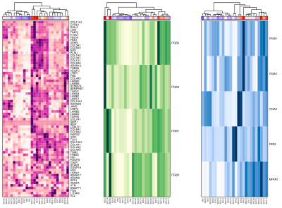

### AlluvialPlot

`alluvial.plot` is a function that enable users to represent the different
interactions between ligands, receptors, and pathways stored in a
BSRInference object.

Obviously, it is possible to filter by ligand, receptor, or pathway. This
is achieved by specifying a key word on the chosen category. A filter on
L-R interaction Q-values can be applied in addition.

```{r AlluvialPlot,results=FALSE,eval=FALSE}   

alluvialPlot(bsrinf,
              keywords = c("COL4A1"),
              type = "L",
              qval = 0.001,
              path = "../man/figures/",
              filename = "sdc_alluvial", 
              width  = 16, 
              height = 12
              )

```


### BubblePlot

`bubblePlotPathwaysLR` is a handy way to visualize the strengths of several
L-R interactions in relation with their receptor downstream pathways.

A vector of pathways of interest can be provided to limit the complexity
of the plot.

```{r BubblePlot,results=FALSE,eval=FALSE} 
pathway1 <- "PD-1 signaling"
pathway2 <- "Interferon gamma signaling"
pathways <- c(pathway1,pathway2)

bubblePlotPathwaysLR(bsrinf,
    pathways = pathways, 
    threshold = 1,
    path = "../man/figures/",
    color = "red",
    filename  = "sdc_bubble", 
    width  = 16, 
    height = 7,
    pointsize = 8
    #filter.L = c("ADAM12")
    #filter.R = c("ITGA3")
    ) 
```
 


### Chordiagram

`chord.diagram.LR` is a function that enable users to feature the different
L-R interactions involved in a specific pathway.

L-R correlations strengths are drawn in a yellow color-scale.  
Ligands are in grey, whereas receptors are in green.  
You can also highlight in red one specific interaction by passing values 
of a L-R pair as follows  `ligand="COL18A1", receptor="ITGA3"`.  

```{r Chordiagram,results=FALSE,eval=FALSE} 
chordDiagramLR (bsrinf,
                  path = "../man/figures/",
                  filename = "sdc_chord",
                  pw.id.filter = "R-HSA-202733",
                  limit = 20,
                  width = 5, 
                  height = 4.5
    )
```

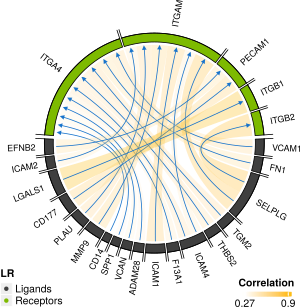

\
\

# Network Analysis

Since `BulkSignalR` relies on intracellular networks to estimate the statistical
significance of (ligand, receptor, pathway triples), links from receptors to
target genes are naturally accessible. Different functions enable users to
exploit this graphical data for plotting or further data analysis.

Furthermore, networks can be exported in text files and graphML objects 
to be further explored with Cytoscape (www.cytoscape.org), 
yEd (www.yworks.com), or similar software tools.

```{r network1, eval=FALSE,cache=TRUE, results=FALSE} 
# Generate a ligand-receptor network and export it in .graphML
# for Cytoscape or similar tools
gLR <- getLRNetwork(bsrinf.redBP, qval.thres=1e-8)

# save to file
# write.graph(gLR,file="SDC-LR-network.graphml",format="graphml")

# As an alternative to Cytoscape, you can play with igraph package functions.
plot(gLR,
     edge.arrow.size=0.1,
     vertex.label.color="black",
     vertex.label.family="Helvetica",
     vertex.label.cex=0.1)

```


```{r network2, eval=FALSE,cache=TRUE, results=FALSE} 
# You can apply other functions.


# Community detection
u.gLR <- as.undirected(gLR) # most algorithms work for undirected graphs only
comm <- cluster_edge_betweenness(u.gLR)
# plot(comm,u.gLR,
#     vertex.label.color="black",
#     vertex.label.family="Helvetica",
#     vertex.label.cex=0.1)

# Cohesive blocks
cb <- cohesive_blocks(u.gLR)
plot(cb,u.gLR,
     vertex.label.color="black",
     vertex.label.family="Helvetica",
     vertex.label.cex=0.1,
     edge.color="black")
```

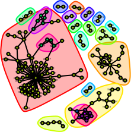

```{r network3, eval=FALSE,cache=TRUE, results=FALSE} 
# For the next steps, we just share the code below but graph generation function
# are commented to lighten the vignette.

# Generate a ligand-receptor network complemented with intra-cellular,
# receptor downstream pathways [computations are a bit longer here]
#
# You can save to a file for cystoscape or plot with igraph.

gLRintra <- getLRIntracellNetwork(bsrinf.redBP, qval.thres=1e-8)

lay <- layout_with_kk(gLRintra)
# plot(gLRintra,
#     layout=lay,
#     edge.arrow.size=0.1,
#     vertex.label.color="black",
#     vertex.label.family="Helvetica",
#     vertex.label.cex=0.1)

# Reduce complexity by focusing on strongly targeted pathways
pairs <- LRinter(bsrinf.redBP)
top <- unique(pairs[pairs$pval<1e-20,c("pw.id","pw.name")])
top
gLRintra.res <- getLRIntracellNetwork(bsrinf.redBP, qval.thres=0.01,
                                      restrict.pw=top$pw.id)
lay <- layout_with_fr(gLRintra.res)

# plot(gLRintra.res,
#     layout=lay,
#     edge.arrow.size=0.1,
#     vertex.label.color="black",
#     vertex.label.family="Helvetica",
#     vertex.label.cex=0.4)
    
```

\
\

# Non human data

\

In order to process data from nonhuman organisms,
users only need to specify a few additional parameters and all the
other steps of the analysis remain unchanged.

By default, `BulksignalR` works with *Homo sapiens*.
We implemented a strategy using ortholog genes (mapped by the 
orthogene BioConductor package) in BulkSignalR directly.

The function `findOrthoGenes` creates a correspondence table between
human and another organism. 
`convertToHuman`  then converts an initial expression matrix to
a *Homo sapiens* equivalent.

When calling `prepareDataset`, the user only needs to pass this transformed
matrix, the actual nonhuman organism, and the correspondence table.
Then, L-R interaction inference is performed as for human data.
Finally, users can switch back to gene names relative to the original organism
via `resetToInitialOrganism`.
The rest of the workflow is executed as usual for
computing gene signatures and visualizing.

\

```{r mouse , cache=TRUE,results=FALSE,eval=FALSE}
data(bodyMap.mouse)

ortholog.dict    <- findOrthoGenes (from_organism = "mmusculus", 
                                     from_values = rownames(bodyMap.mouse))
 
matrix.expression.human <- convertToHuman(counts = bodyMap.mouse, 
                                           dictionary = ortholog.dict)

bsrdm  <- prepareDataset(counts = matrix.expression.human,
           species = "mmusculus",
           conversion.dict = ortholog.dict)

bsrdm <- learnParameters(bsrdm, 
           plot.folder="../man/figures/", filename = "bodyMap.mouse")
 
bsrinf  <- initialInference(bsrdm)

bsrinf  <- resetToInitialOrganism(bsrinf, conversion.dict=ortholog.dict)

# For example, if you want to explore L-R interactions
# you can proceed as shown above for a human dataset.

# bsrinf.redBP <- reduceToBestPathway(bsrinf)  
# bsrsig.redBP <- getLRGeneSignatures(bsrinf.redBP, qval.thres=0.001)
# scoresLR <- scoreLRGeneSignatures(bsrdm,bsrsig.redBP,name.by.pathway=FALSE)
# simpleHeatmap(scoresLR[1:20,], file="sdc_scoreLR.pdf", column.names=TRUE,
# width=9, height=5, pointsize=8)

```

\
\

# Spatial Transcriptomics

\

`BulkSignalR` workflow can be applied to spatial transcriptomics (ST) to find
significant L-R interactions occurring in a tissue. Additional functions
have been introduced to facilitate the visualization and analysis of the
results in a spatial context. The only necessary change is to adapt the
training of the statistical model to shallower data featuring dropouts
and reduced dynamic range. This is achieved by imposing a minimum correlation
at -1 in the training and requiring at least two target genes in a
pathway instead of 4. Also, thresholds on L-R interaction Q-values should
be released slightly such as 1% instead of 0.1%.

A basic spatial function is `spatialPlot` that enables visualizing
L-R interaction gene signature scores at their spatial coordinates with a
potential reference plot (raw tissue image or user-defined areas) on the side.

In the 
[BulkSignalR github companion](https://github.com/jcolinge/BulkSignalR_companion),
we provide scripts to retrieve ST raw data that are the starting point 
to execute our workflow in this specific case.  

\

```{r spatial , eval=FALSE}
# load data =================================================

bench.dir <- "./"

counts <- read.csv(glue("{bench.dir}/Brain_count.export.tsv"),
                   sep="\t", stringsAsFactors=FALSE)

areas <- read.csv(glue("{bench.dir}/Brain_label.export.tsv"),
                  sep="\t", stringsAsFactors=FALSE)

image_low_res_path <-glue("{bench.dir}/Brain_image.export.png"))

# Load from disk and manipulate as a raster object.
my.image.as.raster <- rasterizeFromFile(image_low_res_path)

areas$idSpatial <- paste0("X", areas$idSpatial)
areas           <- areas[areas$idSpatial %in% names(counts),]
areas$label <- areas$ground_truth
areas$label[is.na(areas$label)] <- "unclassified"

# Areas dataframe with id, coordinates and labels is described below.
head(areas)
```
```{r areas , eval=FALSE}
 
 ## idSpatial array_col array_row ground_truth
 ## 50x102       102        50      Label3
 ##   3x43        43         3      Label1
 ##  59x19        19        59      Label2
 ##  14x94        94        14      Label3
 ##   43x9         9        43      Label5
 ##  47x13        13        47      Label6
``` 

```{r spatialnext , eval=FALSE}
# prepare data =================================================

bsrdm <- prepareDataset(counts,symbol.col=1, 
                              min.count=1, 
                              method="TC")

bsrdm <- learnParameters(bsrdm, quick=FALSE,
                         plot.folder="./",
                         min.positive=2, 
                         verbose=TRUE)

bsrinf <- initialInference(bsrdm, min.cor=-1)

# spatial analysis ============================================

bsrinf.red <- reduceToBestPathway(bsrinf)
pairs.red <- LRinter(bsrinf.red)
thres <- 0.01

s.red  <- getLRGeneSignatures(bsrinf.red, qval.thres=thres)
scores <- scoreLRGeneSignatures(bsrdm,s.red)
```

From here, one can start to explore the data 
through different plots.  

```{r spatialPlot , eval=FALSE}
 # Visualization ============================================

# plot one specific interaction
rownames(scores) <- gsub("->","/",rownames(scores))
inter <- gsub("\\}","",gsub("\\{","",rownames(scores)[27]))

# with synthetic tissue reference
svg(glue("../man/figures/spatialPlot_synthref.svg"), width=13, height=7)
spatialPlot(scores[27,], areas, inter, ref.plot=TRUE, ref.plot.only=FALSE,
            image.raster = NULL ,dot.size=1)
dev.off()

# with raw image reference
svg(glue("../man/figures/spatialPlot_rawref.svg"),width=13,height=7)
spatialPlot(scores.red[27,], areas, inter, ref.plot=TRUE, ref.plot.only=FALSE,
            image.raster = my.image.as.raster ,dot.size=1)
dev.off()
```

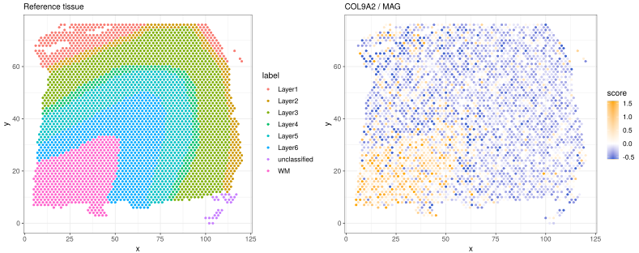
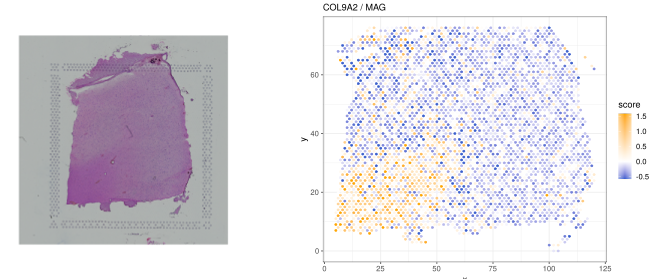

The user can generate a large index picturing all these distributions
for visual inspection and manual selection.   

```{r spatialIndexPlot , eval=FALSE}
# generate visual index on disk
spatialIndexPlot(scores, areas, "../man/figures/bigplot-BSR.pdf")
```
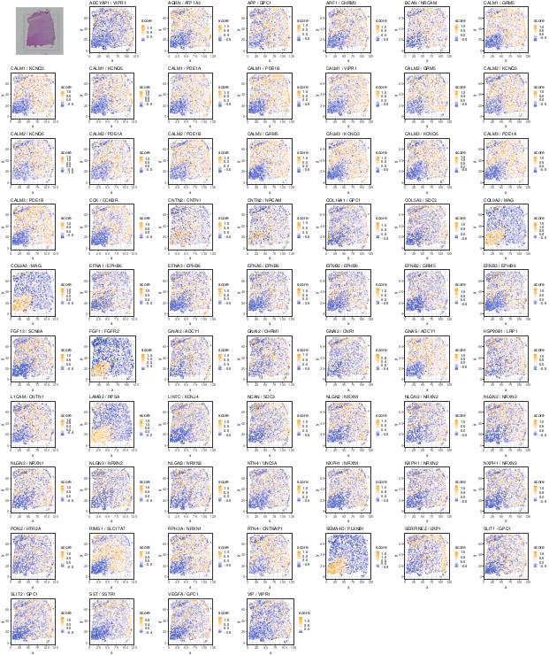

\

Finally, we provide function to assess statistical associations of L-R gene
signature scores with the different user-defined areas of a sample.
Based on these associations, a visualization tool can represent the
latter in the form of a heatmap.  

\

```{r spatialAssociation , eval=FALSE}
# statistical association with tissue areas
assoc.bsr <- spatialAssociation(scores, areas)

svg("../man/figures/spatialAssociationPlot.svg",width=12,height=12)
spatialAssociationPlot(assoc.bsr)
dev.off()
```
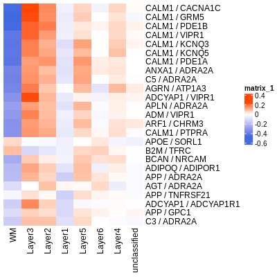

\

## Additional functions

We also provide 2D-projections (see  `spatialDiversityPlot` function) to
assess diversity among L-R interaction spatial distributions over
an entire dataset. Other function as `generateSpatialPlots` can generate on disk
multiple individual spatial plots.

See the reference manual for all the details.

\

# Acknowledgements

We thank Guillaume Tosato for his help with the figures and
Gauthier Gadouas for testing the software on different platforms.

\

Thank you for reading this guide and for using `BulkSignalR`.

\

# Session Information

```{r session-info}
sessionInfo()
```
